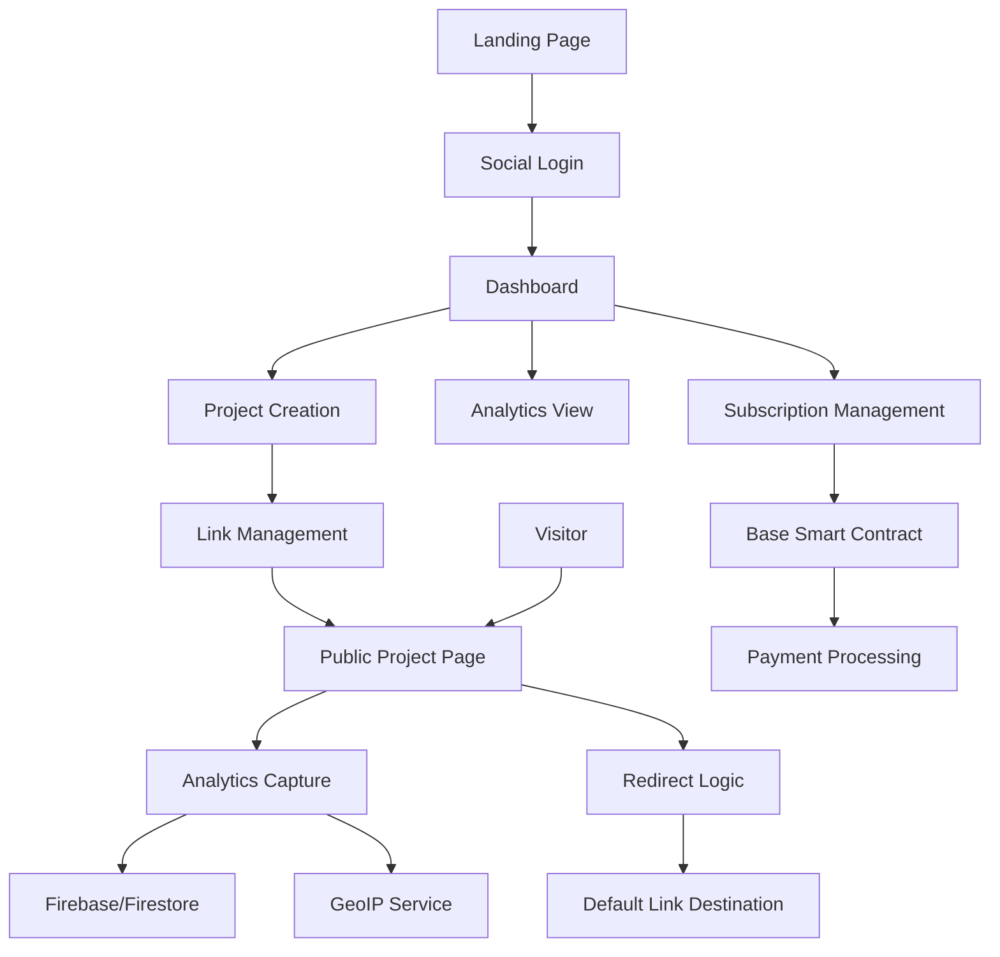
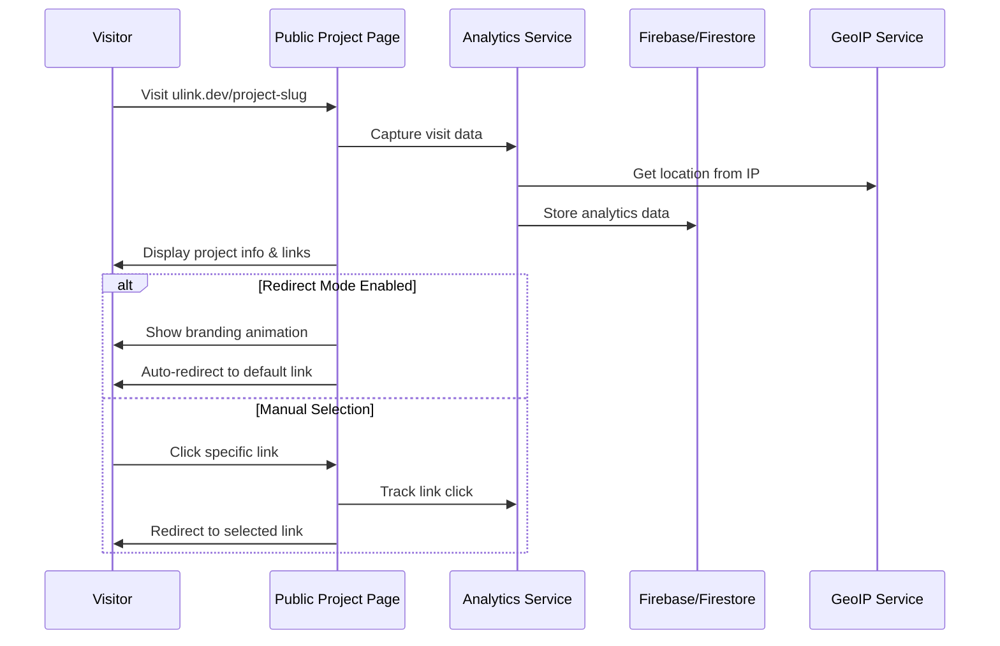

ULink Project Specification (Detailed)

🌟 Project Summary

ULink is a Web3-enabled platform that allows users to create personalized groups of links under a unique URL. It combines features of Linktree and TinyURL with added benefits of analytics, redirect control, and Web3 functionality.

🧩 Problem It Solves

Sharing multiple links across different platforms is messy. Centralized solutions lack trust, transparency, or ownership, and don’t provide in-depth analytics or redirect logic. Web3 projects and creators need decentralized, customizable, and trackable link-sharing solutions.

✅ How ULink Solves It
	•	Customizable link hubs for each project with branded visuals
	•	Web3 and social login for flexible access
	•	Real-time analytics: country, IP, device, click activity
	•	Smart redirect options: show branding and then redirect to a primary destination
	•	Subscription tiers to monetize power features
	•	Built on Base blockchain for payments and Firebase backend for data
	•	QR code generation with the project logo embedded in the center

⸻

👥 App Roles

Visitor (External User)
	•	Accesses unique project link (e.g., https://ulink.dev/my-project)
	•	Sees logo, title, description, and list of links
	•	Gets redirected to default link (if enabled)
	•	Visit is logged anonymously (IP, device, etc.)

Registered User (Creator)
	•	Logs in via wallet or social login
	•	Manages their dashboard and projects
	•	Adds/edit links and branding
	•	Controls redirect options
	•	Views detailed analytics
	•	Generates QR code for each project with embedded logo
	•	Upgrades subscription tier to unlock more features

⸻

🔄 User Workflow

Visitor Flow
	1.	Lands on public project page
	2.	Views project info + links
	3.	Redirected to default link if redirect mode is enabled
	4.	System tracks:
	•	IP → geolocation
	•	Device/browser info
	•	Referrer
	•	Timestamp and click data

Creator Flow
	1.	Visits landing page
	2.	Logs in via social login (Google, Twitter, etc.)
	3.	Clicks on “Dashboard” in the header
	4.	Creates a new project:
	•	Title, description
	•	Logo, hero image
	•	Link types (web, social, form, calendar)
	•	Sets a default link
	•	Enables redirect mode and animation if desired
	5.	Can view analytics and manage subscriptions
	6.	Can generate a QR code with their project logo embedded

⸻

💳 Subscription Plans

Plan	Price	Max Projects	Max Links per Project
Free	$0	1	3
Silver	$1.99/month	5	6
Gold	$9.99/month	20	10

Upsells will be presented in the UI when users hit project or link limits. Payments will be handled via smart contracts on the Base blockchain.

⸻

📁 Core Entities

User
	•	Unique ID (wallet or auth)
	•	Email (optional)

Project
	•	id, slug, title, description
	•	logo, heroImage
	•	defaultLinkId
	•	redirectMode, showAnimation
	•	ownerId

Link
	•	id, projectId
	•	label, url, type (web, social, form, calendar)
	•	isDefault

VisitStat
	•	projectId, timestamp
	•	ip, country, region
	•	device, browser, referrer

⸻

🖼️ App Pages
	•	Landing Page: Explanation of app, pricing, login CTA
	•	Dashboard Page: Authenticated access to manage projects and view analytics
	•	Public Project Page: Viewed at https://ulink.dev/:slug, shows project branding and links

⸻

⚙️ Tech Stack
	•	Frontend: Next.js + Tailwind CSS
	•	Backend: Firebase (Auth, Firestore, Storage)
	•	Blockchain: Base (handles on-chain payments and ownership verification)

⸻

🧠 Architecture Diagram (Mermaid)

⸻

🔁 Sequence Diagram (Visitor Experience)

⸻

🧪 Link Types Supported
	•	Standard Web URLs
	•	Social links (e.g., Twitter, Instagram, Farcaster)
	•	Form tools (e.g., Typeform, Google Forms)
	•	Scheduling tools (e.g., Calendly)
	•	Other app integrations

Each link includes a type to enable platform-specific icons and visual cues.

⸻

🗂️ Future Features
	•	Token/NFT-based gating
	•	ENS support (e.g., creator.ulink.dev)
	•	Scheduled link availability
	•	Link rotation (A/B testing)
	•	Team collaboration features
	•	Prebuilt templates for common tools

⸻

✅ Project Status

ULink is currently in the product specification phase. Next steps include:
	•	Defining the Firebase Firestore schema
	•	Designing UI wireframes
	•	Developing smart contracts for payment and subscription control on the Base blockchain
	•	Building the MVP with Firebase + Base

    