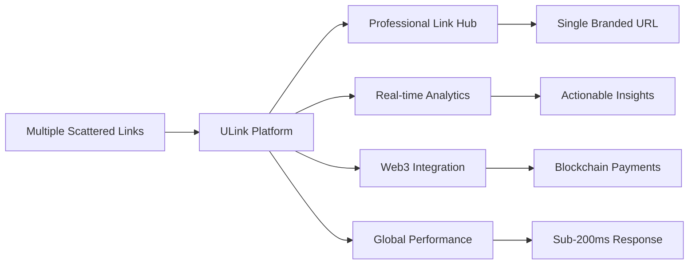
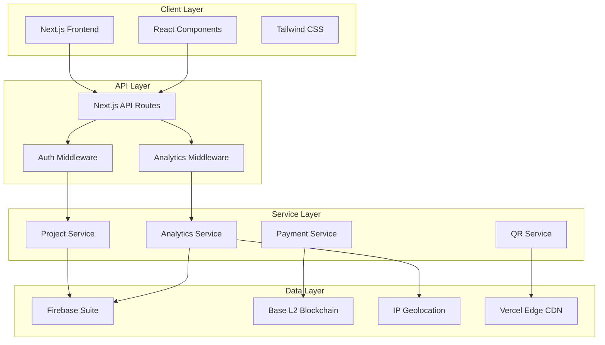
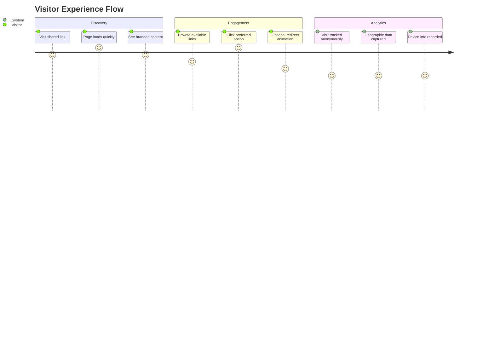
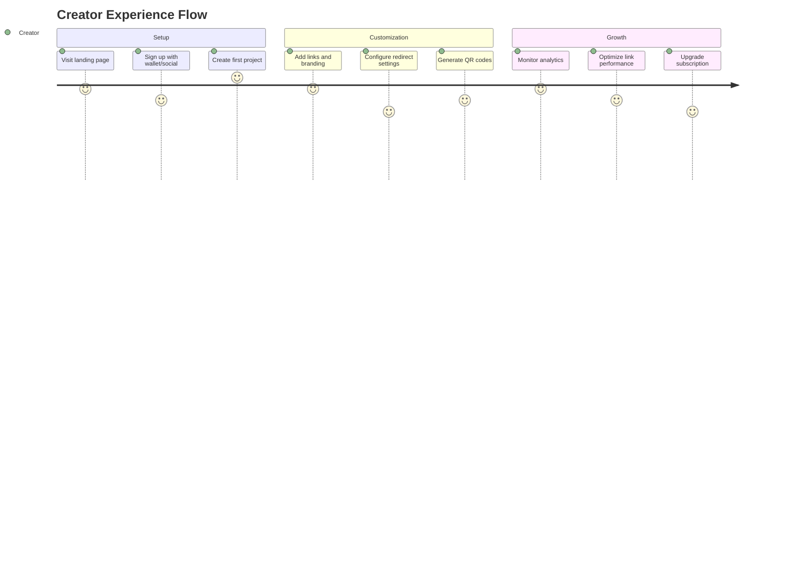
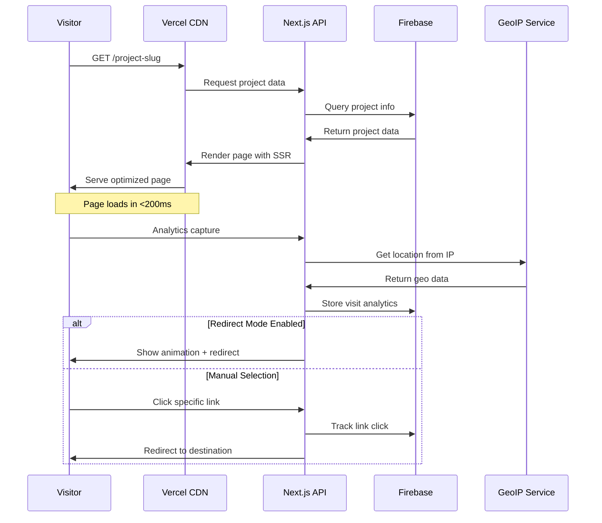
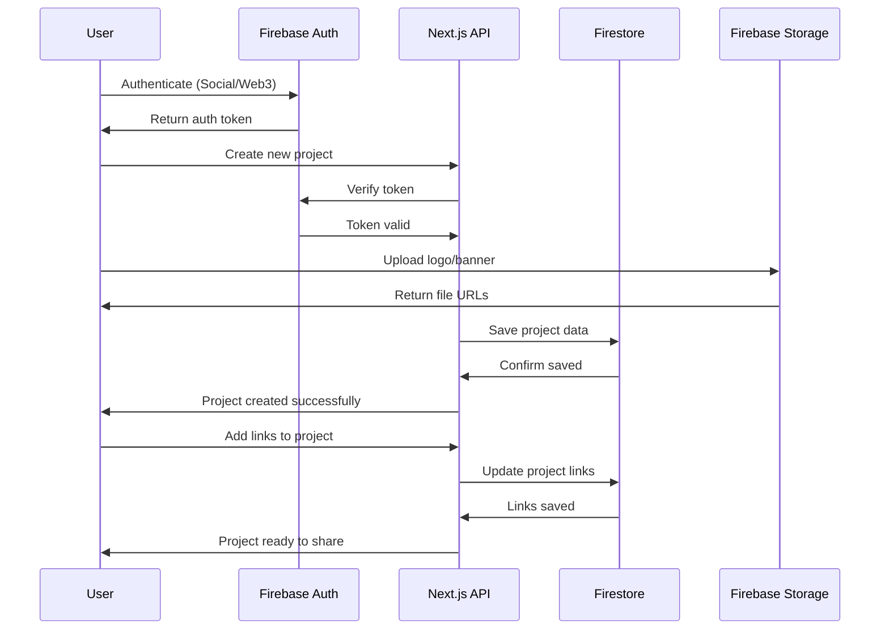
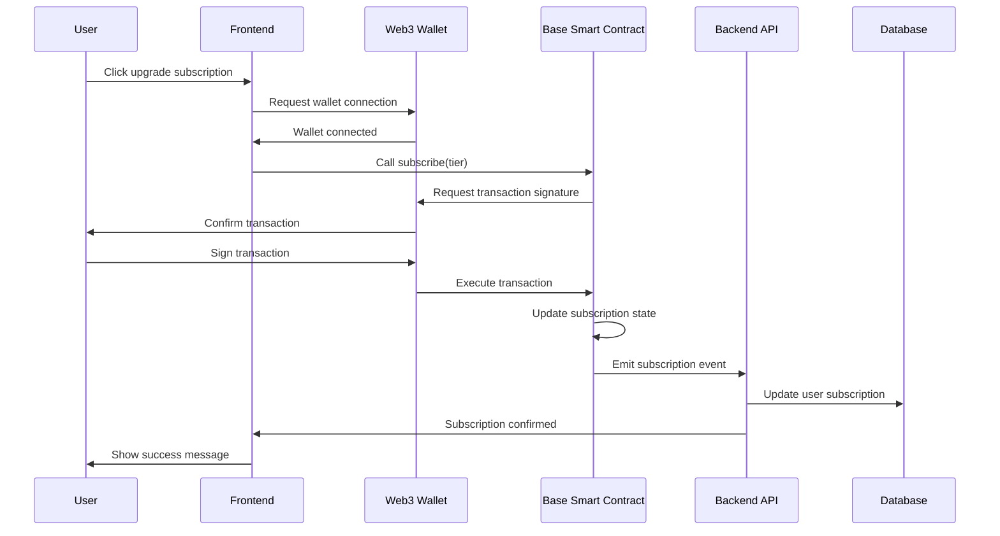

# ULink - Web3-Enabled Link Management Platform

<div align="center">


**Your Links, Beautifully Organized with Web3 Power**

[](https://nextjs.org/)
[](https://www.typescriptlang.org/)
[](https://tailwindcss.com/)
[](https://base.org/)

[Live Demo](https://ulink.dev) • [Documentation](#documentation) • [API Reference](#api-reference) • [Contributing](#contributing)

</div>

## 🌟 **What is ULink?**

ULink is a next-generation Web3-enabled link management platform that revolutionizes how creators and businesses share multiple links. By combining the simplicity of Linktree with the power of TinyURL and adding comprehensive analytics plus Web3 functionality, ULink addresses the fragmented link-sharing landscape with a unified, professional solution.

### **Key Innovation**
- 🔗 **Unified Link Hubs**: Single URL containing multiple destinations with professional branding
- 📊 **Advanced Analytics**: Real-time visitor insights with geographic and device tracking
- ⛓️ **Web3 Integration**: Blockchain-based payments and ownership verification on Base L2
- 🚀 **Global Performance**: Sub-200ms response times worldwide via CDN optimization

---

## 🎯 **Problem & Solution**

### **The Problem**
Content creators and businesses face fragmented link sharing challenges:
- Sharing multiple links across platforms is messy and unprofessional
- Centralized solutions lack ownership, transparency, and deep analytics
- Web3 creators need decentralized, customizable link-sharing tools
- Existing solutions don't provide actionable insights or redirect control

### **ULink's Solution**


---

## 🏗️ **System Architecture**

### **High-Level Architecture**


### **Technology Stack**

| Layer | Technology | Purpose |
|-------|-----------|---------|
| **Frontend** | Next.js 15 + React 19 | Server-side rendering, App Router |
| **Styling** | Tailwind CSS + Shadcn/UI | Design system, component library |
| **Backend** | Firebase Suite | Authentication, database, storage |
| **Blockchain** | Base L2 + Wagmi | Payments, smart contracts |
| **Analytics** | Custom + GeoIP | Real-time visitor tracking |
| **Deployment** | Vercel Edge | Global CDN, serverless functions |

---

## 👥 **User Workflows**

### **Visitor Journey**


### **Creator Journey**


---

## 🔄 **Sequential Diagrams**

### **Public Project Page Visit**


### **Project Creation Flow**


### **Payment Flow (Web3)**


---

## 📁 **Project Structure**

```
ULink/
├── 📋 ESPECIFICATIONS.md       # Complete project specifications
├── 🎨 UX_DESIGN.md            # UX design system and workflows
├── 🏗️ SYSTEM_DESIGN.md        # Technical architecture document
├── 🎨 FRONTEND_DESIGN.md       # Frontend design specifications
├── 📱 ULinkPrototype/          # Next.js application
│   ├── app/                    # Next.js App Router pages
│   │   ├── page.tsx           # Landing page
│   │   ├── dashboard/         # User dashboard
│   │   ├── admin/             # Admin interface
│   │   └── app/[project-slug]/ # Public project pages
│   ├── components/            # React components
│   │   ├── ui/               # Shadcn/UI components (40+)
│   │   ├── dashboard/        # Dashboard-specific components
│   │   └── admin/            # Admin panel components
│   ├── lib/                  # Utility functions
│   └── styles/               # Global styles and theme
├── ⛓️ ULinkContracts/          # Smart contracts (Solidity)
└── 📱 ULinkApp/               # Mobile app (Future)
```

---

## 🚀 **Getting Started**

### **Prerequisites**
- Node.js 18+ (LTS recommended)
- pnpm, npm, or yarn
- Git 2.30+
- Web3 wallet (MetaMask, WalletConnect)

### **Quick Start**

1. **Clone the repository**
   ```bash
   git clone https://github.com/your-org/ULink.git
   cd ULink/ULinkPrototype
   ```

2. **Install dependencies**
   ```bash
   pnpm install
   # or
   npm install
   ```

3. **Set up environment variables**
   ```bash
   cp .env.example .env.local
   # Edit .env.local with your configuration
   ```

4. **Run development server**
   ```bash
   pnpm dev
   # or
   npm run dev
   ```

5. **Open your browser**
   Navigate to [http://localhost:3000](http://localhost:3000)

### **Environment Variables**

```bash
# Firebase Configuration
NEXT_PUBLIC_FIREBASE_API_KEY=your_firebase_api_key
NEXT_PUBLIC_FIREBASE_AUTH_DOMAIN=your_project.firebaseapp.com
NEXT_PUBLIC_FIREBASE_PROJECT_ID=your_project_id

# Web3 Configuration
NEXT_PUBLIC_WALLETCONNECT_PROJECT_ID=your_walletconnect_project_id
NEXT_PUBLIC_BASE_RPC_URL=https://mainnet.base.org

# Analytics
NEXT_PUBLIC_GEOIP_API_KEY=your_geoip_api_key
```

---

## ✨ **Features**

### **🎯 Core Features**
- ✅ **Customizable Link Hubs**: Professional branding with logos, banners, and themes
- ✅ **Real-time Analytics**: Visitor tracking with geographic and device insights
- ✅ **QR Code Generation**: Branded QR codes with embedded project logos
- ✅ **Smart Redirects**: Optional branding animation before destination redirect
- ✅ **Subscription Tiers**: Free, Silver ($1.99), Gold ($9.99) with feature scaling
- ✅ **Multiple Link Types**: Web, social, forms, calendars, and custom integrations

### **📊 Analytics Dashboard**
- **Visitor Insights**: Real-time traffic monitoring and analysis
- **Geographic Data**: Country, region, and city-level visitor breakdown
- **Device Analytics**: Mobile, desktop, tablet usage patterns
- **Link Performance**: Click-through rates and conversion tracking
- **Export Options**: CSV, PDF, and API access for data analysis

### **🎨 Design System**
- **Metallic Accents**: Silver, platinum, and gold color schemes
- **Responsive Design**: Mobile-first approach with adaptive layouts
- **Dark Mode Support**: Automatic theme switching and preference persistence
- **Accessibility**: WCAG 2.1 AA compliance with keyboard navigation

### **⛓️ Web3 Integration**
- **Base L2 Payments**: Low-cost blockchain transactions for subscriptions
- **Wallet Authentication**: MetaMask, WalletConnect, and social login options
- **NFT Integration**: Token-gated access and community features (roadmap)
- **ENS Support**: Custom domain resolution via Ethereum Name Service (roadmap)

---

## 🛠️ **Development**

### **Available Scripts**

| Command | Description |
|---------|-------------|
| `pnpm dev` | Start development server with hot reload |
| `pnpm build` | Build optimized production bundle |
| `pnpm start` | Start production server |
| `pnpm lint` | Run ESLint code quality checks |
| `pnpm type-check` | Run TypeScript type checking |

### **Component Development**

ULink uses a comprehensive design system built on Shadcn/UI:

```typescript
// Example: Creating a new dashboard component
import { Card, CardContent, CardHeader, CardTitle } from "@/components/ui/card"
import { Badge } from "@/components/ui/badge"

export function ProjectStatsCard({ project }) {
  return (
    <Card className="hover:shadow-lg transition-shadow">
      <CardHeader>
        <CardTitle className="flex items-center gap-2">
          {project.title}
          <Badge variant="secondary">{project.tier}</Badge>
        </CardTitle>
      </CardHeader>
      <CardContent>
        <div className="grid grid-cols-3 gap-4">
          <div className="text-center">
            <div className="text-2xl font-bold text-primary-600">
              {project.views}
            </div>
            <div className="text-sm text-gray-500">Views</div>
          </div>
          {/* Additional metrics */}
        </div>
      </CardContent>
    </Card>
  )
}
```

### **Adding New Pages**

With Next.js App Router, create new pages by adding files to the `app/` directory:

```typescript
// app/new-feature/page.tsx
export default function NewFeaturePage() {
  return (
    <div className="container mx-auto py-8">
      <h1 className="text-3xl font-bold mb-6">New Feature</h1>
      {/* Your component content */}
    </div>
  )
}
```

---

## 🔧 **Configuration**

### **Tailwind CSS Customization**

The design system extends Tailwind with custom colors and components:

```typescript
// tailwind.config.ts
theme: {
  extend: {
    colors: {
      // Metallic accent system
      silver: {
        50: "#f8fafc",
        400: "#94a3b8",
        500: "#64748b",
      },
      gold: {
        400: "#fbbf24",
        500: "#f59e0b",
      },
      // Brand colors
      primary: {
        500: "#0ea5e9",
        600: "#0284c7",
      }
    }
  }
}
```

### **Firebase Setup**

1. Create a Firebase project at [console.firebase.google.com](https://console.firebase.google.com)
2. Enable Authentication with your preferred providers
3. Create a Firestore database
4. Set up Firebase Storage for file uploads
5. Add your configuration to `.env.local`

### **Base Blockchain Setup**

1. Get Base network configuration
2. Deploy smart contracts (see `ULinkContracts/`)
3. Configure WalletConnect project ID
4. Set up contract addresses in environment variables

---

## 📊 **Subscription Plans**

| Feature | Free | Silver ($1.99/mo) | Gold ($9.99/mo) |
|---------|------|-------------------|-----------------|
| **Projects** | 1 | 5 | 20 |
| **Links per Project** | 3 | 6 | 10 |
| **Analytics** | Basic | Enhanced | Advanced |
| **Custom Branding** | ❌ | ✅ | ✅ |
| **QR Codes** | ✅ | ✅ | ✅ |
| **API Access** | ❌ | ❌ | ✅ |
| **Custom Domains** | ❌ | ❌ | ✅ |
| **Team Collaboration** | ❌ | ❌ | ✅ |

---

## 🌐 **API Reference**

### **Public Endpoints**

```typescript
// Get public project data
GET /api/public/[slug]
Response: {
  title: string
  description: string
  logo: string
  links: Link[]
  settings: ProjectSettings
}

// Track visitor analytics
POST /api/public/[slug]/visit
Body: {
  referrer?: string
  userAgent: string
}
```

### **Authenticated Endpoints**

```typescript
// Project management
GET    /api/projects          # List user projects
POST   /api/projects          # Create new project
GET    /api/projects/[id]     # Get project details
PUT    /api/projects/[id]     # Update project
DELETE /api/projects/[id]     # Delete project

// Analytics
GET /api/projects/[id]/analytics
Query: {
  startDate?: string
  endDate?: string
  granularity?: 'day' | 'week' | 'month'
}
```

---

## 🎯 **Roadmap**

### **Phase 1: MVP (Completed)**
- ✅ Core link management functionality
- ✅ Basic analytics and visitor tracking
- ✅ Subscription tier system
- ✅ QR code generation
- ✅ Responsive design system

### **Phase 2: Web3 Integration (In Progress)**
- 🔄 Base L2 smart contract deployment
- 🔄 Wallet authentication flow
- 🔄 Crypto payment processing
- ⏳ NFT profile integration

### **Phase 3: Advanced Features (Planned)**
- ⏳ Custom domain support
- ⏳ Team collaboration tools
- ⏳ Advanced analytics export
- ⏳ API access for Gold tier
- ⏳ Mobile app development

### **Phase 4: Enterprise (Future)**
- ⏳ White-label solutions
- ⏳ Enterprise SSO integration
- ⏳ Advanced security features
- ⏳ Dedicated support

---

## 🤝 **Contributing**

We welcome contributions from the community! Please read our [Contributing Guide](CONTRIBUTING.md) for details on:

- Code of conduct
- Development workflow
- Pull request process
- Issue reporting

### **Development Setup**

1. Fork the repository
2. Create a feature branch: `git checkout -b feature/amazing-feature`
3. Commit your changes: `git commit -m 'Add amazing feature'`
4. Push to the branch: `git push origin feature/amazing-feature`
5. Open a Pull Request

---

## 📄 **License**

This project is licensed under the MIT License - see the [LICENSE](LICENSE) file for details.

---

## 🙏 **Acknowledgments**

- [Next.js](https://nextjs.org/) for the incredible React framework
- [Tailwind CSS](https://tailwindcss.com/) for the utility-first CSS framework
- [Shadcn/UI](https://ui.shadcn.com/) for the beautiful component library
- [Base](https://base.org/) for the L2 blockchain infrastructure
- [Vercel](https://vercel.com/) for hosting and deployment platform

---

## 📞 **Support**

- 📧 Email: support@ulink.dev
- 💬 Discord: [Join our community](https://discord.gg/ulink)
- 🐦 Twitter: [@ULinkDev](https://twitter.com/ULinkDev)
- 📚 Documentation: [docs.ulink.dev](https://docs.ulink.dev)

---

<div align="center">

**Built with ❤️ for the Web3 creator economy**

[Website](https://ulink.dev) • [Twitter](https://twitter.com/ULinkDev) • [Discord](https://discord.gg/ulink)

</div>