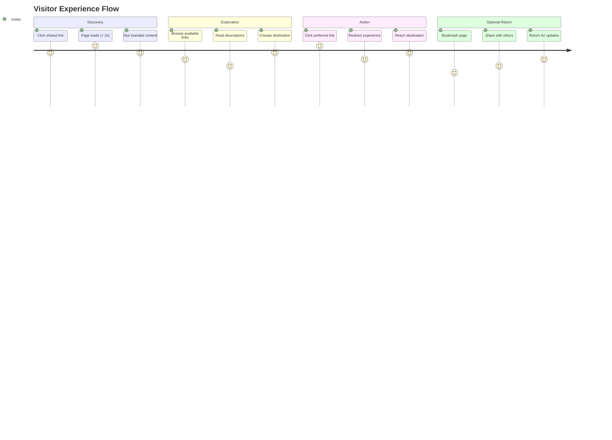
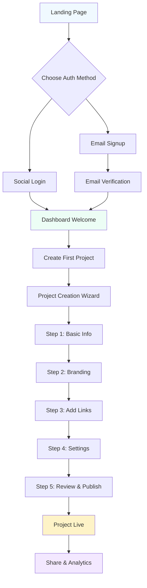
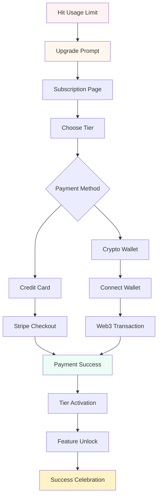
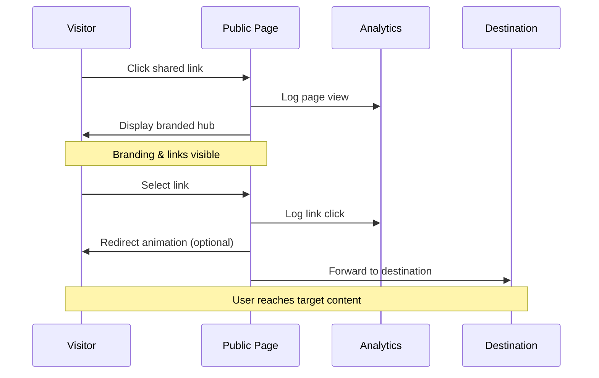
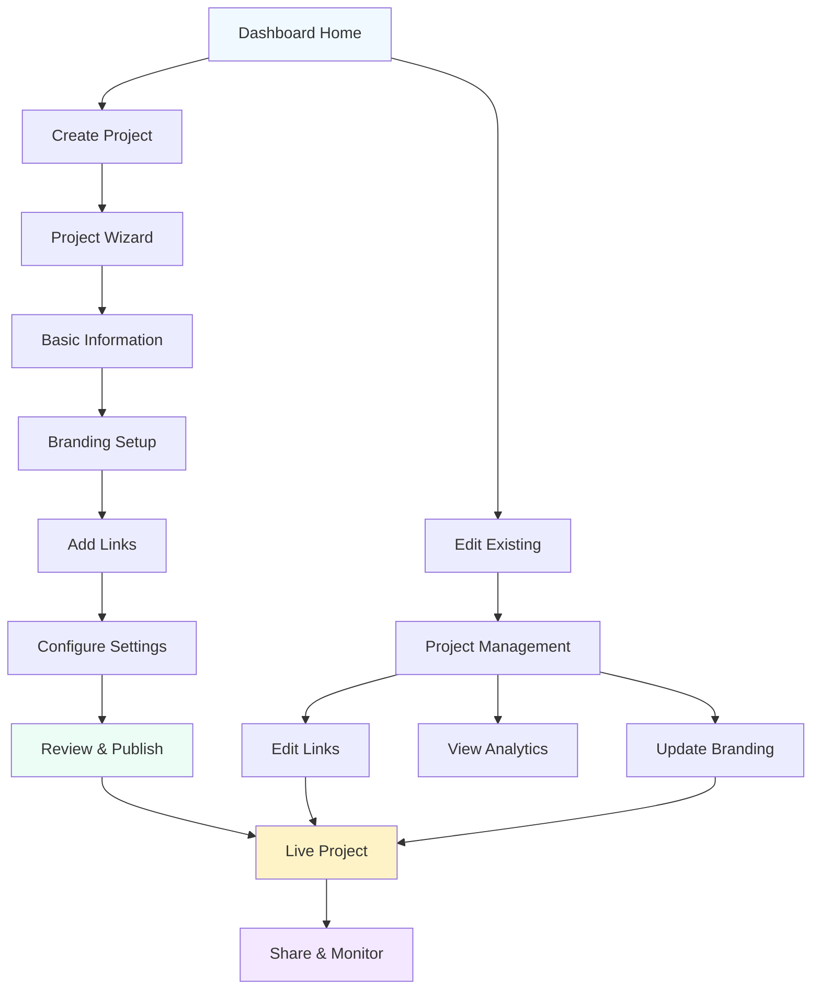
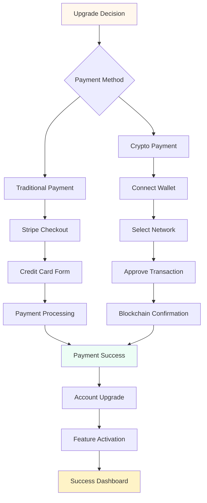

# ULink UX Design Guide & Screen Specifications

*Implementation-ready UX design document with detailed screen workflows, metallic accent system, and role-based user experiences*

---

## 🌟 **About ULink Platform**

### **Project Overview**

**ULink** is a next-generation Web3-enabled link management platform that revolutionizes how creators and businesses share multiple links. By combining the simplicity of Linktree with the power of TinyURL and adding comprehensive analytics plus Web3 functionality, ULink addresses the fragmented link-sharing landscape with a unified, professional solution.

### **Core Value Proposition**

```yaml
Problem Statement:
  - Sharing multiple links across platforms is messy and unprofessional
  - Centralized solutions lack ownership, transparency, and deep analytics
  - Web3 creators need decentralized, customizable link-sharing tools
  - Existing solutions don't provide actionable insights or redirect control

ULink Solution:
  - Personalized link hubs with professional branding
  - Real-time analytics with geographical and device insights
  - Web3 integration with blockchain payments on Base L2
  - Smart redirect options with customizable animations
  - Subscription tiers with transparent pricing and Web3 payments
```

### **Target Users & Market**

#### **Primary User Segments**
- **Web3 Creators**: NFT artists, DeFi projects, crypto influencers
- **Content Creators**: YouTubers, podcasters, newsletter writers, social media influencers
- **Small Businesses**: Agencies, consultants, e-commerce stores
- **Enterprise Customers**: Teams needing branded link management solutions

#### **User Roles & Capabilities**

**Visitors (External Users)**:
- Access public project pages via unique URLs (e.g., `https://ulink.dev/my-project`)
- View creator branding, project descriptions, and organized link collections
- Experience smooth redirects with optional branding animations
- Anonymous analytics tracking (IP geolocation, device info, referrer data)

**Creators (Registered Users)**:
- Authenticate via Web3 wallets or social login (Google, Twitter, GitHub)
- Create and manage multiple branded link projects
- Customize visual branding with logos, hero images, and color schemes
- Configure smart redirect behaviors and animations
- Access detailed analytics dashboards with actionable insights
- Generate QR codes with embedded project logos
- Upgrade subscription tiers for advanced features

### **Platform Architecture & Technology**

#### **Technology Stack**
```yaml
Frontend:
  - Framework: Next.js 14 with App Router
  - Styling: Tailwind CSS with custom metallic design system
  - State Management: Zustand + React Query
  - Authentication: Firebase Auth + Web3 wallet integration

Backend:
  - Platform: Firebase (Authentication, Firestore, Storage, Functions)
  - Analytics: Custom middleware with GeoIP integration
  - Real-time: Firestore listeners for live dashboard updates

Blockchain:
  - Network: Base L2 (Ethereum Layer 2)
  - Payments: Smart contracts for subscription management
  - Wallet Support: WalletConnect, MetaMask, Coinbase Wallet

Infrastructure:
  - Hosting: Vercel with global Edge Network
  - CDN: Vercel Edge for sub-200ms global response times
  - Monitoring: Built-in analytics with performance tracking
```

#### **Core Platform Features**

**Link Management**:
- Support for multiple link types: web URLs, social profiles, forms, calendars
- Drag-and-drop reordering with intuitive interface
- Link categorization with platform-specific icons
- Default link designation for redirect modes
- Bulk link operations and management tools

**Analytics & Insights**:
- Real-time visitor tracking with privacy compliance
- Geographic breakdown with country/region data
- Device and browser analytics
- Referrer source tracking with UTM parameter support
- Click-through rate analysis and performance metrics
- Data export capabilities for external analysis

**Branding & Customization**:
- Logo upload with automatic optimization
- Hero image support with overlay effects
- Custom color scheme selection
- QR code generation with embedded branding
- CSS customization for premium users
- White-label options for enterprise clients

**Web3 Integration**:
- Blockchain-based subscription payments
- Wallet-based authentication and identity
- Smart contract transparency for billing
- Future token-gating capabilities
- ENS domain support (planned)
- Decentralized storage options (roadmap)

### **Subscription Model & Monetization**

#### **Subscription Tiers**
```yaml
Free Tier ($0/month):
  - Max Projects: 1
  - Max Links per Project: 3
  - Basic analytics (30-day retention)
  - ULink branding required
  - Standard support

Silver Tier ($1.99/month):
  - Max Projects: 5
  - Max Links per Project: 6
  - Enhanced analytics (90-day retention)
  - Custom branding options
  - Priority support
  - QR code generation

Gold Tier ($9.99/month):
  - Max Projects: 20
  - Max Links per Project: 10
  - Premium analytics (1-year retention)
  - Advanced customization (custom CSS)
  - Team collaboration features
  - White-label options
  - API access
  - Dedicated support
```

#### **Future Revenue Opportunities**
- Custom domain hosting ($5-10/month premium)
- Enterprise team management ($50-200/month)
- Advanced analytics API access ($50-100/month)
- White-label enterprise solutions ($500-2000/month)
- NFT/token marketplace integration fees (2-5% transaction)

### **User Experience Philosophy**

#### **Design Principles**
1. **Visitor-First Optimization**: Public pages load in under 2 seconds globally
2. **Creator Empowerment**: Intuitive tools that require no technical expertise
3. **Professional Aesthetics**: Premium metallic design system with accessibility focus
4. **Performance Excellence**: Core Web Vitals optimization across all devices
5. **Web3 Innovation**: Seamless blend of traditional UX with blockchain benefits

#### **Accessibility Commitment**
- WCAG 2.1 AA compliance across all interfaces
- Screen reader optimization with semantic markup
- Keyboard navigation support for all interactive elements
- High contrast mode support with alternative color schemes
- Mobile-first responsive design with touch optimization
- Progressive enhancement ensuring core functionality without JavaScript

### **Competitive Positioning**

#### **vs. Linktree**
- **Superior Analytics**: Real-time insights vs. basic view counts
- **Web3 Integration**: Blockchain payments vs. traditional billing only
- **Advanced Customization**: Full branding control vs. limited options
- **Performance**: Global CDN with <200ms response vs. standard hosting

#### **vs. TinyURL/Bit.ly**
- **Project Organization**: Structured link collections vs. individual shortened URLs
- **Branding Control**: Custom project pages vs. generic redirect pages
- **Analytics Depth**: Comprehensive visitor insights vs. basic click tracking
- **Monetization**: Built-in subscription tiers vs. enterprise-only pricing

#### **vs. Custom Solutions**
- **Time to Market**: Minutes to create vs. weeks to develop
- **Maintenance**: Managed platform vs. ongoing development costs
- **Scalability**: Auto-scaling infrastructure vs. manual capacity planning
- **Features**: Built-in analytics and Web3 vs. custom development required

This comprehensive platform overview provides the context needed to understand ULink's position in the market, its technical architecture, and the user experience goals that drive the design specifications outlined in this document.

---

## 🎨 **Visual Design Language & Color System**

### **Metallic Accent Color Palette**

#### **Primary Light Theme Colors**
```css
:root {
  /* Base Light Theme */
  --color-background: #ffffff;
  --color-surface: #fafbfc;
  --color-surface-elevated: #ffffff;
  
  /* Primary Brand with Metallic Gradients */
  --color-primary-50: #f0f9ff;
  --color-primary-100: #e0f2fe;
  --color-primary-200: #bae6fd;
  --color-primary-300: #7dd3fc;
  --color-primary-400: #38bdf8;
  --color-primary-500: #0ea5e9;    /* Main brand blue */
  --color-primary-600: #0284c7;
  --color-primary-700: #0369a1;
  --color-primary-800: #075985;
  --color-primary-900: #0c4a6e;

  /* Metallic Accent System */
  --color-silver-50: #f8fafc;
  --color-silver-100: #f1f5f9;
  --color-silver-200: #e2e8f0;
  --color-silver-300: #cbd5e1;
  --color-silver-400: #94a3b8;     /* Metallic silver accent */
  --color-silver-500: #64748b;
  --color-silver-600: #475569;

  --color-platinum-50: #fafafa;
  --color-platinum-100: #f4f4f5;
  --color-platinum-200: #e4e4e7;
  --color-platinum-300: #d4d4d8;
  --color-platinum-400: #a1a1aa;   /* Platinum accent */
  --color-platinum-500: #71717a;

  --color-gold-50: #fffbeb;
  --color-gold-100: #fef3c7;
  --color-gold-200: #fde68a;
  --color-gold-300: #fcd34d;
  --color-gold-400: #fbbf24;       /* Gold premium accent */
  --color-gold-500: #f59e0b;
  --color-gold-600: #d97706;

  /* Semantic Colors */
  --color-success: #10b981;
  --color-warning: #f59e0b;
  --color-error: #ef4444;
  --color-info: --color-primary-500;

  /* Text Colors */
  --color-text-primary: #111827;
  --color-text-secondary: #6b7280;
  --color-text-tertiary: #9ca3af;
  --color-text-inverse: #ffffff;
}
```

#### **Metallic Gradient System**
```css
/* Premium Metallic Gradients */
.gradient-silver {
  background: linear-gradient(135deg, 
    #f8fafc 0%, 
    #e2e8f0 25%, 
    #cbd5e1 50%, 
    #94a3b8 75%, 
    #64748b 100%);
}

.gradient-platinum {
  background: linear-gradient(135deg, 
    #fafafa 0%, 
    #f4f4f5 25%, 
    #e4e4e7 50%, 
    #a1a1aa 75%, 
    #71717a 100%);
}

.gradient-gold {
  background: linear-gradient(135deg, 
    #fffbeb 0%, 
    #fef3c7 25%, 
    #fde68a 50%, 
    #fbbf24 75%, 
    #f59e0b 100%);
}

/* Brand Primary Gradient */
.gradient-primary {
  background: linear-gradient(135deg, 
    #0ea5e9 0%, 
    #0284c7 50%, 
    #0369a1 100%);
}

/* Glass Effect with Metallic Overlay */
.glass-metallic {
  background: rgba(255, 255, 255, 0.9);
  backdrop-filter: blur(10px);
  border: 1px solid rgba(148, 163, 184, 0.2);
  box-shadow: 
    0 4px 6px -1px rgba(0, 0, 0, 0.1),
    0 2px 4px -1px rgba(148, 163, 184, 0.3),
    inset 0 1px 0 rgba(255, 255, 255, 0.9);
}
```

#### **Subscription Tier Color Mapping**
```css
/* Tier-based Metallic Accents */
.tier-free {
  --accent-color: var(--color-silver-400);
  --accent-gradient: var(--gradient-silver);
  --accent-glow: rgba(148, 163, 184, 0.3);
}

.tier-silver {
  --accent-color: var(--color-platinum-400);
  --accent-gradient: var(--gradient-platinum);
  --accent-glow: rgba(161, 161, 170, 0.4);
}

.tier-gold {
  --accent-color: var(--color-gold-400);
  --accent-gradient: var(--gradient-gold);
  --accent-glow: rgba(251, 191, 36, 0.4);
}
```

---

## 👥 **User Roles & Experience Architecture**

### **Role-Based Access Patterns**

#### **Visitor (External User) Experience**
```yaml
Primary Goals:
  - Quick access to links without friction
  - Clear visual hierarchy and branding
  - Fast loading and mobile optimization
  - Optional social sharing

Behavioral Patterns:
  - 70% mobile traffic
  - 3-second attention span
  - Expects instant loading
  - May return for updates

Design Priorities:
  - Performance > customization
  - Clarity > aesthetics
  - Accessibility > advanced features
```

#### **Creator (Registered User) Experience**
```yaml
Primary Goals:
  - Easy project creation and management
  - Brand customization and control
  - Actionable analytics insights
  - Subscription value realization

Behavioral Patterns:
  - Multi-device usage (mobile creation, desktop analytics)
  - Iterative content updates
  - Analytics monitoring
  - Feature discovery

Design Priorities:
  - Efficiency > complexity
  - Insights > raw data
  - Customization > standardization
  - Growth > limitations
```

---

## 📱 **Screen-by-Screen Design Specifications**

### **1. Landing Page (Public Entry Point)**

#### **Purpose & User Goals**
- **Primary Goal**: Convert visitors to registered users
- **Secondary Goal**: Communicate value proposition clearly
- **User Intent**: Understanding ULink benefits and pricing

#### **Visual Design & Layout**
```yaml
Header Section:
  - Logo: ULink wordmark with metallic gradient accent
  - Navigation: Features, Pricing, Login (metallic button), Sign Up (primary gradient)
  - Background: Clean white with subtle silver gradient overlay

Hero Section:
  - Headline: "Your Links, Beautifully Organized" (48px, bold)
  - Subheadline: "Create stunning link hubs with analytics" (18px, secondary text)
  - CTA Button: "Start Free" (primary gradient, 56px height)
  - Hero Image: Animated preview of link hub on mobile device
  - Background: Subtle radial gradient from white to silver-50

Features Section:
  - 3-column grid (mobile: stacked)
  - Feature cards with glass-metallic effect
  - Icons: Metallic silver with brand accent
  - Micro-animations on scroll

Pricing Section:
  - 3-tier layout with metallic tier indicators
  - Free (silver), Silver (platinum), Gold (gold gradient)
  - Popular badge with gold metallic glow
  - Feature comparison with checkmarks

Social Proof:
  - Customer logos with silver tint overlay
  - Testimonials with metallic quote styling
  - Usage statistics with animated counters
```

#### **Interactive Elements**
- **CTA Hover**: Gradient shift with subtle scale animation
- **Feature Cards**: Lift effect with metallic border glow
- **Pricing Cards**: Tier-appropriate metallic border on hover
- **Scroll Animations**: Progressive reveal with silver shimmer

#### **Responsive Behavior**
- Mobile: Single column, larger touch targets, simplified navigation
- Tablet: Two-column features, condensed hero
- Desktop: Full grid layout, enhanced animations

---

### **2. Authentication Screens**

#### **2.1 Login Screen**

#### **Purpose & User Goals**
- **Primary Goal**: Quick access to dashboard
- **Secondary Goal**: Offer multiple authentication methods
- **User Intent**: Secure, frictionless login experience

#### **Visual Design & Layout**
```yaml
Layout Structure:
  - Centered card (max-width: 400px)
  - Glass-metallic background with subtle blur
  - Soft drop shadow with silver tint

Header:
  - ULink logo with metallic accent
  - "Welcome back" heading (32px)
  - Subtitle: "Access your link dashboard" (16px, secondary)

Authentication Options:
  - Social Login Buttons:
    * Google: White background, silver border, hover lift
    * Twitter: Brand blue with metallic highlight
    * GitHub: Dark with platinum accents
  - Divider: "or" with metallic line styling
  - Email/Password Form:
    * Floating labels with silver focus states
    * Password visibility toggle (metallic icon)
    * "Remember me" checkbox with custom styling

Footer:
  - "Don't have an account?" link
  - Terms and Privacy links (silver text)
  - Forgot password link (primary color)
```

#### **Interactive Elements**
- **Social Buttons**: Metallic border glow on hover
- **Form Fields**: Silver to primary color transition on focus
- **Submit Button**: Primary gradient with loading state
- **Error States**: Red accent with silver background

#### **2.2 Sign Up Screen**

#### **Purpose & User Goals**
- **Primary Goal**: Smooth onboarding process
- **Secondary Goal**: Collect minimal required information
- **User Intent**: Quick account creation and first project setup

#### **Visual Design & Layout**
```yaml
Progressive Form Design:
  Step 1 - Account Creation:
    - Social login options (same as login)
    - Basic email/password form
    - Terms acceptance checkbox
  
  Step 2 - Profile Setup (Optional):
    - Display name input
    - Avatar upload with preview
    - Timezone selection
  
  Step 3 - First Project (Optional):
    - "Create your first link hub" prompt
    - Quick project title input
    - Skip option with silver styling

Visual Enhancements:
  - Progress bar with metallic gradient fill
  - Step indicators with silver/gold states
  - Smooth slide transitions between steps
  - Success celebrations with metallic confetti
```

---

### **3. Dashboard Interface**

#### **3.1 Dashboard Home**

#### **Purpose & User Goals**
- **Primary Goal**: Quick overview of all projects and performance
- **Secondary Goal**: Easy access to key actions
- **User Intent**: Monitor activity, create content, manage account

#### **Visual Design & Layout**
```yaml
Navigation Structure:
  Sidebar (Desktop):
    - Logo with metallic accent
    - Navigation items with hover states
    - User profile section at bottom
    - Subscription tier indicator (metallic badge)
  
  Mobile Header:
    - Hamburger menu with silver icon
    - Logo centered
    - Profile avatar (right)

Main Content Area:
  Header Section:
    - "Welcome back, [Name]" (28px)
    - Current date and time
    - Quick stats overview
    - "New Project" CTA (primary gradient)
  
  Stats Cards Grid:
    - Total Views: Primary card with blue gradient
    - Projects: Silver metallic card
    - Click Rate: Platinum card with percentage
    - Growth: Gold card for premium users
  
  Projects Overview:
    - Grid/List toggle (metallic toggle switch)
    - Search and filter controls
    - Project cards with hover animations
    - "Create New" card with dashed border

  Recent Activity:
    - Timeline view with metallic connector lines
    - Activity icons with brand colors
    - Relative timestamps
    - View all link with silver styling
```

#### **Interactive Elements**
- **Project Cards**: Hover lift with metallic border glow
- **Stats Cards**: Animated counters on load
- **Navigation**: Active state with metallic highlight
- **Search**: Instant results with silver dropdown

#### **3.2 Project Management Screen**

#### **Purpose & User Goals**
- **Primary Goal**: Comprehensive project overview and editing
- **Secondary Goal**: Analytics insights and link management
- **User Intent**: Monitor performance, update content, optimize links

#### **Visual Design & Layout**
```yaml
Header Section:
  - Project title with edit icon
  - Status indicator (active/paused with metallic dots)
  - Share button with copy animation
  - Settings dropdown (gear icon)
  - View public page button (external link icon)

Tabs Navigation:
  - Overview (selected with metallic underline)
  - Links (with count badge)
  - Analytics (with trending icon)
  - Settings (with gear icon)

Overview Tab:
  Performance Metrics:
    - Large stats cards with metallic gradients
    - Trend indicators with arrows
    - Time period selector (last 7/30/90 days)
  
  Quick Actions:
    - Add Link button (primary)
    - Edit Branding button (silver)
    - Generate QR Code button (platinum)
    - Duplicate Project button (secondary)

Links Tab:
  Links Management:
    - Drag-and-drop reordering with metallic handles
    - Link cards with type icons and stats
    - Add new link card (dashed border)
    - Bulk actions toolbar
  
  Link Editor Modal:
    - URL input with validation
    - Label input with character counter
    - Type selector with icons
    - Default link toggle
    - Preview card

Analytics Tab:
  Charts and Insights:
    - Traffic chart with metallic grid lines
    - Geographic breakdown map
    - Device/browser statistics
    - Top referrers list
    - Export data button (silver)

Settings Tab:
  Project Configuration:
    - Basic info form
    - Branding customization
    - Redirect settings
    - Advanced options
    - Danger zone (red accent)
```

#### **3.3 Analytics Dashboard**

#### **Purpose & User Goals**
- **Primary Goal**: Deep insights into link performance
- **Secondary Goal**: Actionable data for optimization
- **User Intent**: Understand audience, optimize content, track growth

#### **Visual Design & Layout**
```yaml
Header Controls:
  - Project selector dropdown
  - Date range picker with presets
  - Export options menu
  - Real-time toggle switch

Overview Section:
  Key Metrics Grid:
    - Total Clicks: Large number with trend
    - Unique Visitors: Silver card with percentage
    - Click-through Rate: Platinum card with gauge
    - Top Link: Gold card for best performer
  
  Traffic Chart:
    - Line chart with metallic gradient fill
    - Hover tooltips with detailed data
    - Zoom and pan functionality
    - Compare periods overlay

Detailed Analytics:
  Geographic Data:
    - World map with heat overlay
    - Country breakdown table
    - Silver highlighting for top regions
  
  Link Performance:
    - Sortable table with metallic headers
    - Performance bars with gradient fills
    - Click distribution pie chart
    - Link-specific CTR metrics
  
  Visitor Insights:
    - Device breakdown (mobile/desktop/tablet)
    - Browser statistics with icons
    - Time-based activity patterns
    - Returning vs new visitors
  
  Referral Sources:
    - Social platform breakdown
    - Direct vs referred traffic
    - Top referral URLs
    - UTM parameter analysis
```

---

### **4. Public Project Page (Visitor Experience)**

#### **Purpose & User Goals**
- **Primary Goal**: Seamless access to creator's links
- **Secondary Goal**: Positive brand experience
- **User Intent**: Find and access specific content quickly

#### **Visual Design & Layout**
```yaml
Page Structure:
  Hero Section:
    - Creator's hero image (optional, with overlay)
    - Profile picture (circular, 80px)
    - Project title (32px, bold)
    - Description (18px, secondary color)
    - Social proof (visitor count, subtle silver text)

  Links Section:
    - Clean, spacious link cards (60px height minimum)
    - Type-specific icons with metallic styling
    - Hover animations with lift effect
    - Clear typography hierarchy
    - Touch-optimized spacing (mobile)

  Branding:
    - Creator's custom colors (if set)
    - ULink watermark (silver, bottom)
    - Custom CSS support (premium)
    - Logo integration options

Redirect Experience:
  Animation Mode:
    - Smooth fade transition
    - Creator branding display (2 seconds)
    - "Redirecting to..." message
    - Progress indicator with metallic styling
  
  Instant Mode:
    - Direct redirect (no animation)
    - Optimized for performance
    - Fallback message if redirect fails
```

#### **Interactive Elements**
- **Link Cards**: Subtle scale on touch/hover
- **Copy Link**: One-click share with toast confirmation
- **QR Code**: Expandable with metallic border
- **Social Sharing**: Platform-specific buttons

#### **Performance Optimizations**
- Critical CSS inlined
- Images optimized and lazy-loaded
- Minimal JavaScript for analytics
- CDN distribution for global speed

---

### **5. Project Creation Wizard**

#### **Purpose & User Goals**
- **Primary Goal**: Quick, intuitive project setup
- **Secondary Goal**: Encourage branding and customization
- **User Intent**: Create professional link hub efficiently

#### **Visual Design & Layout**
```yaml
Wizard Steps:
  Step 1 - Basic Info:
    - Project title input (required)
    - URL slug with availability check
    - Description textarea (optional)
    - Continue button (primary gradient)
  
  Step 2 - Branding:
    - Logo upload with drag-and-drop
    - Hero image upload (optional)
    - Color scheme picker with presets
    - Preview panel (real-time updates)
  
  Step 3 - Add Links:
    - Link URL input with auto-detection
    - Custom label input
    - Type selection (auto-suggested)
    - Add more links option
    - Set default link toggle
  
  Step 4 - Settings:
    - Redirect mode toggle
    - Animation preferences
    - Privacy settings
    - SEO options (premium)
  
  Step 5 - Review:
    - Mobile/desktop preview
    - Edit any step option
    - Publish button (success gradient)
    - Share immediately option

Progress Indicators:
  - Step numbers with metallic circles
  - Progress bar with gradient fill
  - Breadcrumb navigation
  - Back/Next button styling
```

#### **Interactive Elements**
- **File Uploads**: Drag-and-drop with silver border animations
- **Preview Panel**: Live updates with smooth transitions
- **Color Picker**: Custom metallic color wells
- **Validation**: Real-time feedback with appropriate colors

---

### **6. Subscription Management**

#### **Purpose & User Goals**
- **Primary Goal**: Clear tier comparison and upgrade path
- **Secondary Goal**: Transparent billing and usage
- **User Intent**: Understand value, upgrade when needed

#### **Visual Design & Layout**
```yaml
Current Plan Section:
  - Tier badge with metallic styling
  - Usage meters with gradient fills
  - Renewal date and billing info
  - Manage billing button (silver)

Upgrade Options:
  - Three-tier comparison table
  - Feature highlights with checkmarks
  - Popular tier emphasis (gold glow)
  - Upgrade buttons with tier colors

Usage Dashboard:
  - Projects: Progress bar (silver to red)
  - Links per project: Multiple progress bars
  - Analytics retention: Circular progress
  - Monthly usage summary

Billing History:
  - Clean table with metallic headers
  - Invoice download links
  - Payment method display
  - Next billing preview

Web3 Payment Flow:
  - Connect wallet button (metallic gradient)
  - Network selection (Base/Ethereum)
  - Transaction preview with fees
  - Confirmation states with loading
  - Success animation with confetti
```

---

## 🔄 **User Flow Workflows**

### **Visitor Journey Map**



### **Creator Onboarding Flow**



### **Premium Upgrade Journey**



---

## 🎭 **Interaction Design Patterns**

### **Metallic Animation System**

#### **Hover Effects**
```css
/* Card Hover with Metallic Glow */
.card-hover {
  transition: all 0.3s cubic-bezier(0.4, 0, 0.2, 1);
  box-shadow: 0 1px 3px rgba(0, 0, 0, 0.1);
}

.card-hover:hover {
  transform: translateY(-2px);
  box-shadow: 
    0 10px 25px rgba(0, 0, 0, 0.1),
    0 0 20px rgba(148, 163, 184, 0.3);
  border-color: var(--color-silver-300);
}

/* Button Gradient Shift */
.btn-metallic {
  background: linear-gradient(135deg, var(--color-silver-100), var(--color-silver-300));
  transition: background 0.3s ease;
}

.btn-metallic:hover {
  background: linear-gradient(135deg, var(--color-silver-200), var(--color-silver-400));
}

/* Loading Shimmer Effect */
@keyframes shimmer {
  0% { background-position: -200px 0; }
  100% { background-position: calc(200px + 100%) 0; }
}

.loading-shimmer {
  background: linear-gradient(
    90deg,
    var(--color-gray-200) 0px,
    var(--color-silver-200) 40px,
    var(--color-gray-200) 80px
  );
  background-size: 200px;
  animation: shimmer 1.5s infinite;
}
```

#### **Success States**
```css
/* Success Animation with Metallic Accent */
@keyframes success-pulse {
  0% { 
    transform: scale(1);
    box-shadow: 0 0 0 0 rgba(16, 185, 129, 0.7);
  }
  70% { 
    transform: scale(1.05);
    box-shadow: 0 0 0 10px rgba(16, 185, 129, 0);
  }
  100% { 
    transform: scale(1);
    box-shadow: 0 0 0 0 rgba(16, 185, 129, 0);
  }
}

.success-state {
  animation: success-pulse 0.6s ease-out;
  border: 2px solid var(--color-success);
  background: linear-gradient(135deg, #ecfdf5, #d1fae5);
}
```

### **Micro-Interactions Catalog**

#### **Form Interactions**
- **Input Focus**: Silver border to primary gradient transition
- **Validation Success**: Green checkmark with metallic shine
- **Error State**: Red border with silver background tint
- **Auto-complete**: Dropdown with glass-metallic effect

#### **Navigation Interactions**
- **Active Tab**: Metallic underline with gradient
- **Breadcrumbs**: Silver separators with hover states
- **Dropdown Menus**: Smooth slide with metallic borders
- **Mobile Menu**: Overlay with backdrop blur

#### **Data Visualization**
- **Chart Animations**: Progressive draw with metallic grid
- **Progress Bars**: Gradient fill with shimmer effect
- **Stat Counters**: Animated count-up with metallic glow
- **Loading States**: Skeleton screens with shimmer

---

## 📊 **Component Specifications**

### **Button Component System**

#### **Primary Button (CTA)**
```css
.btn-primary {
  background: linear-gradient(135deg, #0ea5e9, #0284c7);
  color: white;
  padding: 12px 24px;
  border-radius: 12px;
  font-weight: 600;
  transition: all 0.3s cubic-bezier(0.4, 0, 0.2, 1);
  box-shadow: 0 4px 6px rgba(14, 165, 233, 0.25);
}

.btn-primary:hover {
  background: linear-gradient(135deg, #0284c7, #0369a1);
  transform: translateY(-1px);
  box-shadow: 0 8px 15px rgba(14, 165, 233, 0.4);
}
```

#### **Secondary Button (Metallic)**
```css
.btn-secondary {
  background: linear-gradient(135deg, #f8fafc, #e2e8f0);
  color: var(--color-text-primary);
  border: 1px solid var(--color-silver-300);
  padding: 12px 24px;
  border-radius: 12px;
  font-weight: 500;
  transition: all 0.3s ease;
}

.btn-secondary:hover {
  background: linear-gradient(135deg, #e2e8f0, #cbd5e1);
  border-color: var(--color-silver-400);
  box-shadow: 0 0 15px rgba(148, 163, 184, 0.3);
}
```

#### **Ghost Button (Minimal)**
```css
.btn-ghost {
  background: transparent;
  color: var(--color-primary-600);
  border: 1px solid transparent;
  padding: 12px 24px;
  border-radius: 12px;
  font-weight: 500;
  transition: all 0.2s ease;
}

.btn-ghost:hover {
  background: var(--color-primary-50);
  border-color: var(--color-primary-200);
  color: var(--color-primary-700);
}
```

### **Card Component System**

#### **Project Card**
```css
.project-card {
  background: white;
  border: 1px solid var(--color-gray-200);
  border-radius: 16px;
  padding: 24px;
  transition: all 0.3s cubic-bezier(0.4, 0, 0.2, 1);
  position: relative;
  overflow: hidden;
}

.project-card::before {
  content: '';
  position: absolute;
  top: 0;
  left: 0;
  right: 0;
  height: 4px;
  background: var(--gradient-primary);
  opacity: 0;
  transition: opacity 0.3s ease;
}

.project-card:hover {
  transform: translateY(-4px);
  box-shadow: 
    0 20px 25px rgba(0, 0, 0, 0.1),
    0 0 30px rgba(148, 163, 184, 0.2);
  border-color: var(--color-silver-300);
}

.project-card:hover::before {
  opacity: 1;
}
```

#### **Link Card (Public Page)**
```css
.link-card {
  background: white;
  border: 1px solid var(--color-gray-200);
  border-radius: 12px;
  padding: 16px 20px;
  min-height: 60px;
  display: flex;
  align-items: center;
  transition: all 0.2s ease;
  position: relative;
  overflow: hidden;
}

.link-card::after {
  content: '';
  position: absolute;
  top: 0;
  bottom: 0;
  right: 0;
  width: 0;
  background: linear-gradient(90deg, transparent, rgba(14, 165, 233, 0.1));
  transition: width 0.3s ease;
}

.link-card:hover {
  transform: scale(1.02);
  border-color: var(--color-primary-300);
  box-shadow: 0 8px 20px rgba(14, 165, 233, 0.15);
}

.link-card:hover::after {
  width: 100%;
}
```

### **Input Component System**

#### **Text Input with Metallic Focus**
```css
.input-primary {
  width: 100%;
  padding: 12px 16px;
  border: 2px solid var(--color-gray-200);
  border-radius: 8px;
  font-size: 16px;
  transition: all 0.3s ease;
  background: white;
}

.input-primary:focus {
  outline: none;
  border-color: var(--color-primary-500);
  box-shadow: 
    0 0 0 3px rgba(14, 165, 233, 0.1),
    0 0 15px rgba(148, 163, 184, 0.2);
  background: var(--color-primary-50);
}

.input-primary:invalid {
  border-color: var(--color-error);
  box-shadow: 0 0 0 3px rgba(239, 68, 68, 0.1);
}
```

### **Navigation Component System**

#### **Sidebar Navigation**
```css
.sidebar-nav {
  width: 256px;
  background: white;
  border-right: 1px solid var(--color-gray-200);
  height: 100vh;
  position: fixed;
  z-index: 50;
}

.nav-item {
  display: flex;
  align-items: center;
  padding: 12px 16px;
  margin: 4px 8px;
  border-radius: 8px;
  color: var(--color-text-secondary);
  text-decoration: none;
  transition: all 0.2s ease;
  position: relative;
}

.nav-item:hover {
  background: var(--color-gray-50);
  color: var(--color-text-primary);
}

.nav-item.active {
  background: var(--color-primary-50);
  color: var(--color-primary-700);
  border-left: 3px solid var(--color-primary-500);
}

.nav-item.active::before {
  content: '';
  position: absolute;
  left: 0;
  top: 0;
  bottom: 0;
  width: 3px;
  background: var(--gradient-primary);
}
```

### **Modal Component System**

#### **Modal with Glass Effect**
```css
.modal-overlay {
  position: fixed;
  inset: 0;
  background: rgba(0, 0, 0, 0.5);
  backdrop-filter: blur(8px);
  display: flex;
  align-items: center;
  justify-content: center;
  z-index: 100;
  animation: modal-enter 0.3s ease-out;
}

.modal-content {
  background: white;
  border-radius: 16px;
  padding: 32px;
  max-width: 500px;
  width: 90%;
  max-height: 90vh;
  overflow-y: auto;
  box-shadow: 
    0 25px 50px rgba(0, 0, 0, 0.25),
    0 0 50px rgba(148, 163, 184, 0.3);
  border: 1px solid rgba(255, 255, 255, 0.2);
  position: relative;
}

.modal-content::before {
  content: '';
  position: absolute;
  top: 0;
  left: 0;
  right: 0;
  height: 1px;
  background: var(--gradient-primary);
}

@keyframes modal-enter {
  from {
    opacity: 0;
    transform: scale(0.95) translateY(20px);
  }
  to {
    opacity: 1;
    transform: scale(1) translateY(0);
  }
}
```

---

## 🔄 **Role-Based Screen Workflows**

### **Visitor Workflow (External Users)**

#### **Entry Point Optimization**
```yaml
Landing Experience:
  - Instant page load (< 2s target)
  - Clear visual hierarchy
  - Minimal cognitive load
  - Mobile-optimized interface

Link Hub Experience:
  - Creator branding prominence
  - Intuitive link categorization
  - One-tap access to content
  - Optional social sharing

Exit Experience:
  - Smooth redirect transitions
  - Branded loading states
  - Error handling with alternatives
  - Return visit encouragement
```

#### **Visitor Journey Touchpoints**


### **Creator Workflow (Registered Users)**

#### **Dashboard Navigation Patterns**
```yaml
Primary Actions:
  - Create New Project (always visible)
  - View Analytics (prominent placement)
  - Manage Links (quick access)
  - Account Settings (secondary menu)

Secondary Actions:
  - Export Data (analytics section)
  - Generate QR Codes (project level)
  - Duplicate Projects (bulk actions)
  - Team Collaboration (premium)

Contextual Actions:
  - Edit Project (hover states)
  - Share Links (copy to clipboard)
  - Preview Changes (real-time)
  - Upgrade Prompts (usage limits)
```

#### **Content Management Flow**


### **Subscription Management Workflow**

#### **Upgrade Trigger Points**
```yaml
Usage Limit Triggers:
  - Project creation limit reached
  - Links per project exceeded  
  - Analytics retention expired
  - Custom domain requested

Upgrade Presentation:
  - Contextual modal overlays
  - Feature comparison highlights
  - Clear value propositions
  - Multiple payment options

Post-Upgrade Experience:
  - Immediate feature activation
  - Onboarding for new capabilities
  - Success celebrations
  - Feature discovery prompts
```

#### **Payment Flow Options**


---

## 📱 **Responsive Design Specifications**

### **Breakpoint Strategy**
```css
/* Mobile-First Responsive Breakpoints */
:root {
  --breakpoint-sm: 640px;   /* Small mobile to large mobile */
  --breakpoint-md: 768px;   /* Tablet portrait */
  --breakpoint-lg: 1024px;  /* Tablet landscape / small desktop */
  --breakpoint-xl: 1280px;  /* Desktop */
  --breakpoint-2xl: 1536px; /* Large desktop */
}

/* Component-specific breakpoints */
.container {
  width: 100%;
  padding: 1rem;
}

@media (min-width: 640px) {
  .container { padding: 1.5rem; max-width: 640px; margin: 0 auto; }
}

@media (min-width: 768px) {
  .container { padding: 2rem; max-width: 768px; }
}

@media (min-width: 1024px) {
  .container { padding: 2rem; max-width: 1024px; }
}

@media (min-width: 1280px) {
  .container { max-width: 1280px; }
}
```

### **Mobile Optimization Guidelines**

#### **Touch Target Specifications**
```yaml
Minimum Touch Targets:
  - Buttons: 44px × 44px minimum
  - Links: 40px × 40px minimum  
  - Form inputs: 48px height minimum
  - Navigation items: 44px height minimum

Touch Spacing:
  - Between interactive elements: 8px minimum
  - Around touch targets: 4px padding minimum
  - Finger-friendly margins: 12px between sections

Mobile-Specific Enhancements:
  - Haptic feedback on supported devices
  - Swipe gestures for navigation
  - Pull-to-refresh functionality
  - Touch-optimized form controls
```

#### **Performance Optimization**
```yaml
Mobile Performance Targets:
  - First Contentful Paint: < 1.5s
  - Largest Contentful Paint: < 2.5s
  - Cumulative Layout Shift: < 0.1
  - First Input Delay: < 100ms

Optimization Strategies:
  - Critical CSS inlining
  - Progressive image loading
  - Service worker caching
  - Efficient bundle splitting
  - CDN edge caching
```

---

## 🎨 **Implementation Guidelines**

### **CSS Custom Properties Setup**
```css
/* Core theme variables */
:root {
  /* Spacing scale */
  --space-xs: 0.25rem;    /* 4px */
  --space-sm: 0.5rem;     /* 8px */
  --space-md: 1rem;       /* 16px */
  --space-lg: 1.5rem;     /* 24px */
  --space-xl: 2rem;       /* 32px */
  --space-2xl: 3rem;      /* 48px */

  /* Typography scale */
  --text-xs: 0.75rem;     /* 12px */
  --text-sm: 0.875rem;    /* 14px */
  --text-base: 1rem;      /* 16px */
  --text-lg: 1.125rem;    /* 18px */
  --text-xl: 1.25rem;     /* 20px */
  --text-2xl: 1.5rem;     /* 24px */
  --text-3xl: 1.875rem;   /* 30px */
  --text-4xl: 2.25rem;    /* 36px */

  /* Border radius scale */
  --radius-sm: 0.375rem;  /* 6px */
  --radius-md: 0.5rem;    /* 8px */
  --radius-lg: 0.75rem;   /* 12px */
  --radius-xl: 1rem;      /* 16px */

  /* Shadow system */
  --shadow-sm: 0 1px 2px rgba(0, 0, 0, 0.05);
  --shadow-md: 0 4px 6px rgba(0, 0, 0, 0.1);
  --shadow-lg: 0 10px 15px rgba(0, 0, 0, 0.1);
  --shadow-xl: 0 20px 25px rgba(0, 0, 0, 0.1);
  
  /* Metallic shadows */
  --shadow-metallic: 0 0 20px rgba(148, 163, 184, 0.3);
  --shadow-gold: 0 0 20px rgba(251, 191, 36, 0.4);
  --shadow-platinum: 0 0 20px rgba(161, 161, 170, 0.4);
}
```

### **Component Development Standards**
```typescript
// Component prop interface template
interface ComponentProps {
  // Visual variants
  variant?: 'primary' | 'secondary' | 'metallic' | 'ghost';
  size?: 'sm' | 'md' | 'lg';
  
  // State props
  loading?: boolean;
  disabled?: boolean;
  active?: boolean;
  
  // Accessibility props
  'aria-label'?: string;
  'aria-describedby'?: string;
  role?: string;
  
  // Event handlers
  onClick?: () => void;
  onFocus?: () => void;
  onBlur?: () => void;
  
  // Standard props
  className?: string;
  children?: React.ReactNode;
}

// Component implementation template
export function Component({
  variant = 'primary',
  size = 'md',
  loading = false,
  disabled = false,
  className,
  children,
  ...props
}: ComponentProps) {
  return (
    <element
      className={cn(
        // Base styles
        'component-base',
        
        // Variants
        {
          'variant-primary': variant === 'primary',
          'variant-secondary': variant === 'secondary',
          'variant-metallic': variant === 'metallic',
          'variant-ghost': variant === 'ghost',
        },
        
        // Sizes
        {
          'size-sm': size === 'sm',
          'size-md': size === 'md',
          'size-lg': size === 'lg',
        },
        
        // States
        {
          'is-loading': loading,
          'is-disabled': disabled,
        },
        
        className
      )}
      disabled={disabled || loading}
      aria-busy={loading}
      {...props}
    >
      {children}
    </element>
  );
}
```

---

## 📋 **UX Design System Summary**

### **🎨 Design Language Highlights**

✨ **Metallic Accent System**: Premium light theme with silver, platinum, and gold gradients
🎯 **User-Centered Focus**: Visitor experience prioritized with creator empowerment
📱 **Mobile-First Excellence**: 44px+ touch targets with optimized performance
♿ **Accessibility by Default**: WCAG 2.1 AA compliance with comprehensive screen reader support

### **🖼️ Key Screen Specifications**

🏠 **Landing Page**: Hero-driven conversion with metallic feature cards and tier-based pricing
🔐 **Authentication**: Glass-effect modals with social login and progressive onboarding
📊 **Dashboard**: Sidebar navigation with metallic accents and real-time analytics
🎨 **Project Management**: Tabbed interface with drag-and-drop link management
🌐 **Public Pages**: Performance-optimized visitor experience with smooth redirects
⚙️ **Subscription**: Clear tier comparison with Web3 payment integration

### **🔄 User Flow Excellence**

👤 **Visitor Journey**: Click → Load (< 2s) → Branded hub → Link selection → Smooth redirect
✍️ **Creator Workflow**: Login → Dashboard → Create project → Add links → Publish → Monitor
💳 **Upgrade Process**: Usage limit → Modal prompt → Tier selection → Payment → Feature activation

### **🎭 Interaction Design Features**

✨ **Hover Effects**: Metallic glow animations with elevation changes
🌟 **Loading States**: Shimmer effects with brand-appropriate skeleton screens
🎯 **Focus Management**: Visible indicators with metallic accent colors
📈 **Data Visualization**: Progressive chart animations with metallic grid lines

### **🛠️ Implementation-Ready Assets**

📐 **Component Library**: Complete button, card, input, and navigation specifications
🎨 **CSS Variables**: Comprehensive color, spacing, and typography systems
📱 **Responsive Breakpoints**: Mobile-first strategy with performance optimization
♿ **Accessibility Props**: TypeScript interfaces with ARIA support

### **🚀 Performance Standards**

⚡ **Core Web Vitals**: LCP < 2.5s, FID < 100ms, CLS < 0.1
📦 **Bundle Optimization**: Code splitting with lazy loading strategies
🌐 **Global CDN**: Edge caching for sub-200ms response times
📱 **Mobile Excellence**: Touch-optimized with haptic feedback support

This comprehensive UX design system provides everything needed to build ULink with premium aesthetics, exceptional usability, and enterprise-grade performance. The metallic accent system creates visual hierarchy while maintaining accessibility, and the detailed screen specifications ensure consistent implementation across all user touchpoints.